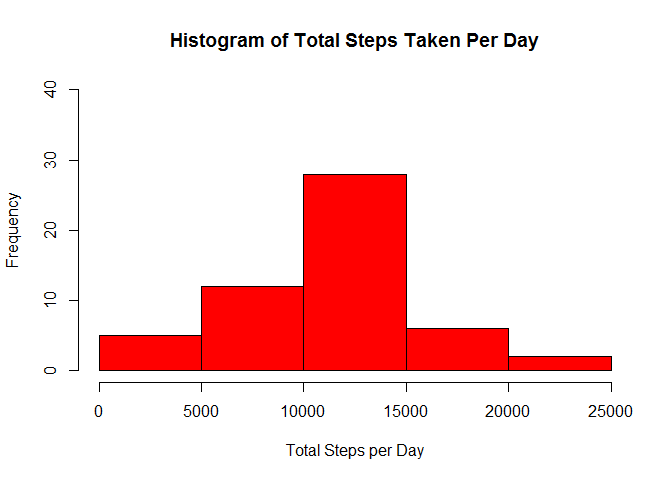
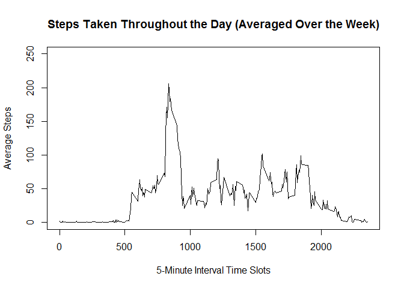
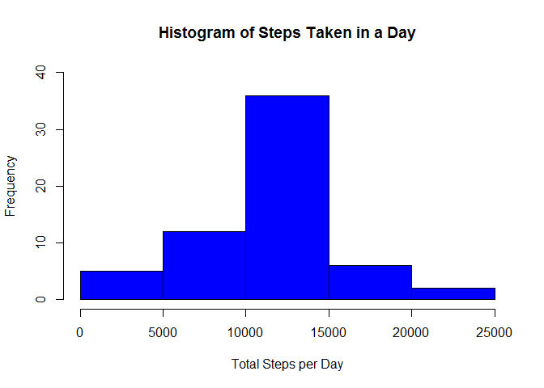
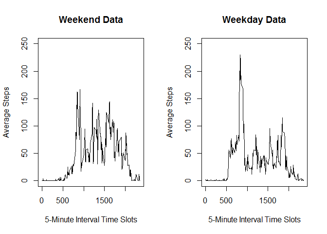

# Reproducible Research: Peer Assessment 1
Coursera  - Reproducible Research Course  
Project 1 - Process Personal Activity Data  
Author - J. Szijjarto  

## Loading and preprocessing the data
Download zipped Activity monitoring data  

```r
data <- read.csv(unz('activity.zip', 'activity.csv'))
```

The variables included in this csv dataset are:  
**steps:** Number of steps taken in a 5-minute interval  
**date:** The date on which the measurement was taken in YYYY-MM-DD format  
**interval:** Identifier for the 5-minute interval in which measurement was taken  
  
Here are the first few lines of data:

```
##   steps       date interval
## 1    NA 2012-10-01        0
## 2    NA 2012-10-01        5
## 3    NA 2012-10-01       10
## 4    NA 2012-10-01       15
## 5    NA 2012-10-01       20
## 6    NA 2012-10-01       25
```


Tidy up the data.

```r
data <- transform(data, interval = factor(interval))
dataComplete <- data[complete.cases(data),]  # remove NA's
```


## What is the mean total number of steps taken per day?
Calculate total steps taken in each day and produce histogram of the results.

```r
stepsPerDay <- tapply(data$steps, data$date, sum)
hist(stepsPerDay,
     main="Histogram of Total Steps Taken Per Day",
     ylim=c(0,40),
     xlab="Total Steps per Day",
     col = "red"
)
```

 

Calculate the mean and median of total steps taken per day. (Notice that they differ in value)

```r
mean(stepsPerDay, na.rm=TRUE)
```

```
## [1] 10766.19
```

```r
median(stepsPerDay, na.rm=TRUE)
```

```
## [1] 10765
```


## What is the average daily activity pattern?
Calculate and plot the average steps taken in each 5-minute interval of the day across all days of the week. 

```r
avgStepsPerInterval <- tapply(dataComplete$steps, dataComplete$interval, mean)  
plot(names(avgStepsPerInterval), avgStepsPerInterval, type="l",
     ylim=c(0,250), main="Steps Taken Throughout the Day (Averaged Over the Week)", 
     ylab="Average Steps", xlab="5-Minute Interval Time Slots")
```

 

Determine the 5-minute interval that contains the maximum number of steps.

```r
avgStepsPerInterval[which.max(avgStepsPerInterval)]
```

```
##      835 
## 206.1698
```


## Inputting missing values
Determine the total number of missing values (i.e. NA's) in the dataset. 

```r
naRows <- !complete.cases(data)
sum(naRows)
```

```
## [1] 2304
```

Create a copy of the original dataset and replace each NA in the steps column with the average value for that 5-minute interval.

```r
dataFilled <- data
dataFilled$steps <- replace(dataFilled$steps, is.na(dataFilled$steps), 
                            avgStepsPerInterval[dataFilled$interval]) 
```


Calculate total steps taken in each day and produce a histogram of the results. (Manually compare this histogram where NA values are replaced with average values, with the previous one that ignored NA values. This histogram data contains more total steps per day.)


```r
stepsPerDay <- tapply(dataFilled$steps, dataFilled$date, sum)
hist(stepsPerDay,
     main="Histogram of Steps Taken in a Day",
     xlab="Total Steps per Day",
     ylim=c(0,40),
     col = "blue"
)
```

 

Calculate the mean and median of the total number of steps taken per day. Notice that the mean and median are equal in value. Refer to the previous calculation above where they differed in value. 

```r
mean(stepsPerDay, na.rm=TRUE)
```

```
## [1] 10766.19
```

```r
median(stepsPerDay, na.rm=TRUE)
```

```
## [1] 10766.19
```


## Are there differences in activity patterns between weekdays and weekends?
Determine and plot the average steps per interval for weekend and weekday periods. (Overall, activity on the weekends is higher, but peak activity is during the week at ~8:30am)


```r
# Create a new factor indicating weekend date
dataFilled$weekend <- 
  weekdays(as.Date(dataFilled$date)) %in% c('Saturday','Sunday')

# Calculate average steps per interval for weekend and weekday slots
dataFilledWeekend <- dataFilled[dataFilled$weekend == TRUE,]
avgStepsPerIntervalWeekend <- 
  tapply(dataFilledWeekend$steps, dataFilledWeekend$interval, mean)
dataFilledWeekday <- dataFilled[dataFilled$weekend == FALSE,]
avgStepsPerIntervalWeekday <- 
  tapply(dataFilledWeekday$steps, dataFilledWeekday$interval, mean)

# Plot Steps Per Interval for Weekend and Weekdays
par(mfrow=c(1,2))
plot(names(avgStepsPerIntervalWeekend), avgStepsPerIntervalWeekend, 
     type="l", ylim=c(0,250), main="Weekend Data", ylab="Average Steps", 
     xlab="5-Minute Interval Time Slots")
plot(names(avgStepsPerIntervalWeekday), avgStepsPerIntervalWeekday, 
     type="l", ylim=c(0,250), main="Weekday Data", ylab="Average Steps", 
     xlab="5-Minute Interval Time Slots")
```

 


